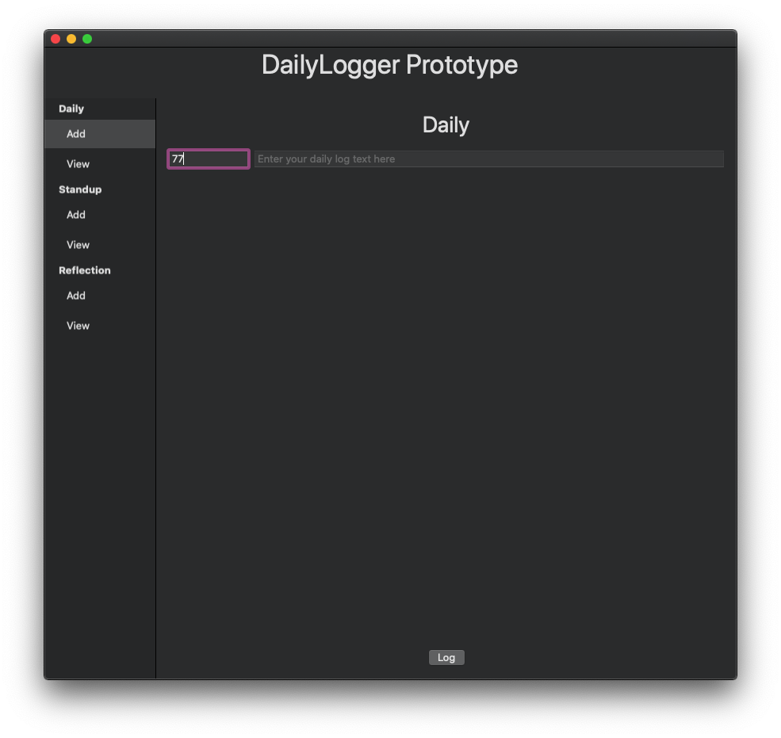
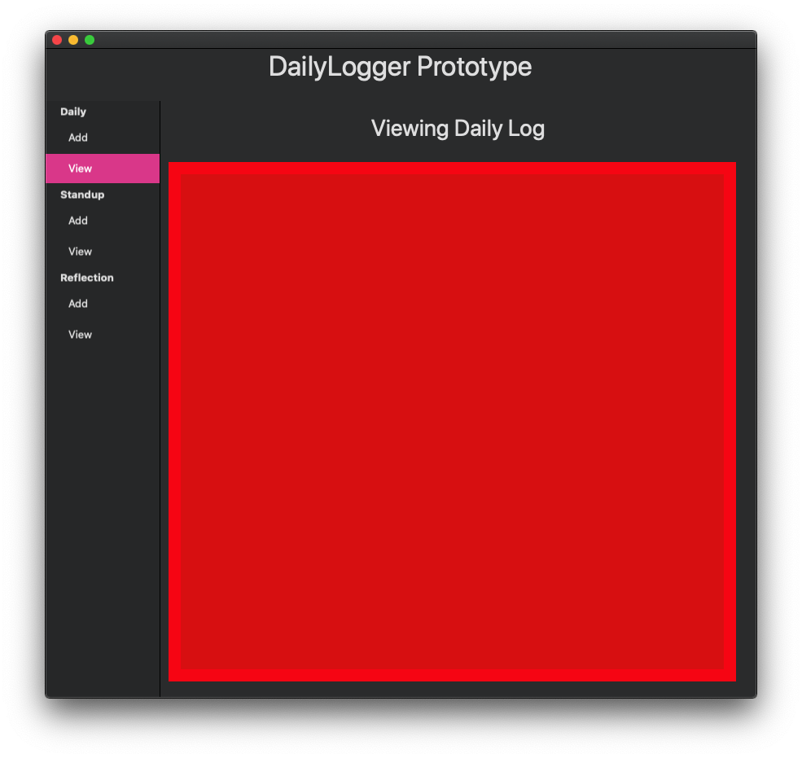

#  DLPrototype

This is a small macOS application I've been using to play with `swiftui` and to dabble in `swift` development in general over the past few years.  The whole thing is a WIP and I caution you that it does NOT follow any swift coding standards beyond what the compiler enforces, nor is there any attempt at system architecture.  It's an app front end for a plain text file. 

New workflow will be basically that but with a GUI.  Eventually it will be a cross platform database of sorts.

