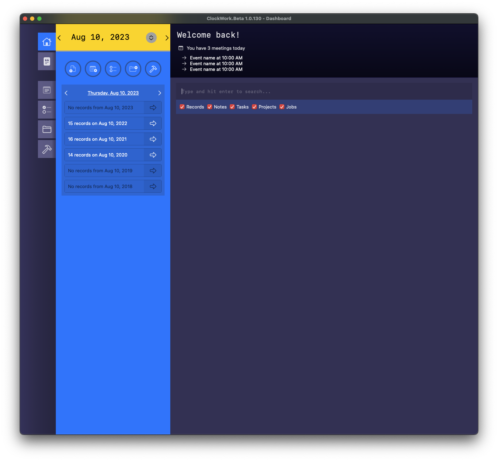

#  KlockWork (formerly DLPrototype)

The productivity app for ADHD people. Well that's the goal, anyways.

## Major Features

* Simple task tracking
* Simple note taking
* People, Companies, Projects and Jobs. These are your high level organizational items.
* Lastly, the activity log (Today view) where you log what you're working on.

See the [wiki](https://github.com/aapis/DLPrototype/wiki) for more details.

